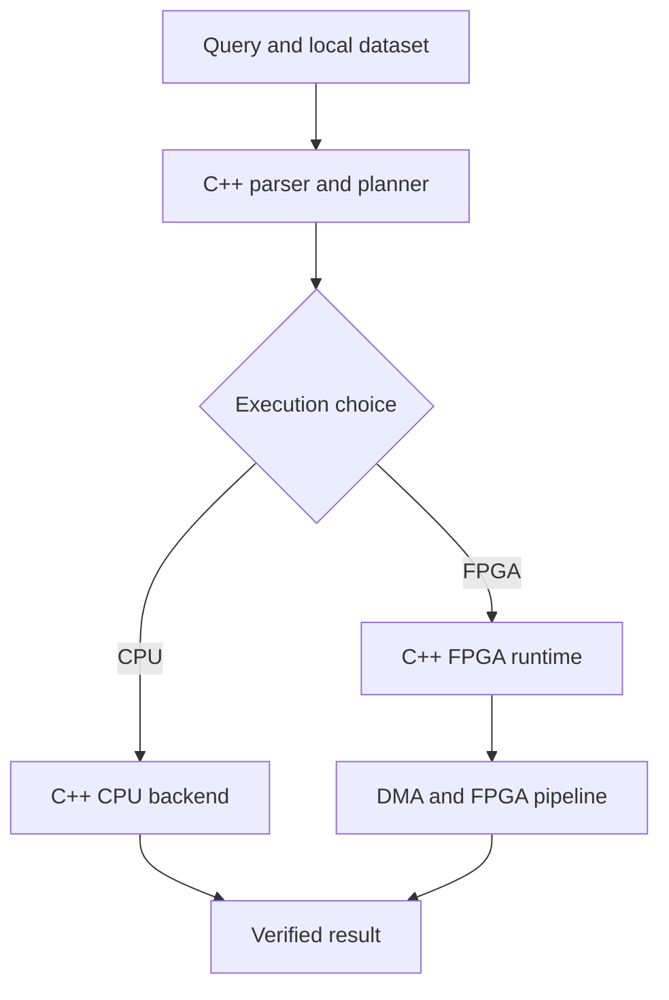

# FPGA Query Engine

# FPGA-Accelerated Columnar Query Engine

> **Status:** Planning and initial C++ implementation

This project implements a small columnar analytical query engine on the PYNQ-Z2. A C++ application running on the Zynq Processing System (PS) parses queries, executes them on an ARM CPU backend, and offloads suitable operations to a custom accelerator in the Programmable Logic (PL).

The goal is not to build a complete database. It is to demonstrate modern C++, embedded Linux integration, DMA, AXI, RTL acceleration, and performance-driven hardware/software partitioning.

## What is a columnar query engine?

A database table stores structured data. A **query** asks for selected data or a calculation, while a **query engine** interprets that request and executes the required operations.

In row-oriented storage, all fields belonging to one record are placed together:

```text
[1200, 600, 1]
 [900, 700, 2]
[1500, 100, 1]
```

In columnar storage, values from the same field are contiguous:

```text
price:      [1200, 900, 1500]
quantity:   [600,  700, 100]
instrument: [1,    2,   1]
```

Analytical queries generally scan many rows but use only a few columns. The columnar layout lets the engine read only the required fields and gives the FPGA predictable streams of identically typed values. This makes filtering, arithmetic, and aggregation suitable for pipelined execution.

## Example query

```sql
SELECT SUM(price * quantity), COUNT(*)
FROM trades
WHERE quantity > 500 AND price BETWEEN 1000 AND 2000;
```

Given:

| Price | Quantity | Passes filter? | Product |
| ---: | ---: | :---: | ---: |
| 1200 | 600 | Yes | 720000 |
| 900 | 700 | No | — |
| 1500 | 100 | No | — |
| 1800 | 800 | Yes | 1440000 |

the result is:

```text
COUNT = 2
SUM   = 1200 × 600 + 1800 × 800
      = 2160000
```

The query performs four operations:

1. **Scan** the required columns.
2. **Filter** rows using the conditions.
3. **Project** each accepted row into `price * quantity`.
4. **Aggregate** the products and accepted-row count.

## System architecture



The CPU implementation is the golden reference. Every FPGA result will be compared against it.

### End-to-end FPGA flow

1. C++ loads a dataset from the SD card.
2. It converts the required fields into typed column buffers in DDR3.
3. It writes query parameters through AXI4-Lite.
4. AXI DMA reads the column buffers from DDR3.
5. DMA streams the values into the FPGA.
6. The FPGA filters, calculates optional expressions, and updates its aggregators.
7. The result is returned through registers or a small DDR3 output buffer.
8. C++ reads, validates, and displays the result.

## Shared DDR3 memory

There is not one complete database copy on the PS and another in the PL. The processed columns reside in the same physical DDR3 memory.

The PS creates and fills the buffers. AXI DMA reaches those buffers through the Zynq high-performance AXI ports and PS DDR controller. The PL uses BRAM only for small, fast state such as:

- running sums, counts, minima, and maxima;
- predicate thresholds;
- pipeline registers and FIFOs; and
- potentially a small group-by table.

Because the ARM is cached while DMA accesses DDR directly, the C++ runtime must also manage cache coherency and DMA-buffer ownership correctly.

## C++ software

### Query frontend

The frontend converts SQL-like text into a validated query:

- **Tokenizer:** separates identifiers, numbers, keywords, and operators.
- **Recursive parser:** determines how those tokens relate.
- **Expression AST:** stores the query as a tree of operations.
- **Type checker:** rejects missing columns and invalid type combinations.
- **Logical plan:** describes which operations are required.
- **Physical plan:** selects concrete CPU or FPGA operators.
- **Predicate simplifier:** removes redundant conditions.
- **FPGA eligibility analysis:** checks whether the hardware supports the query.

For example:

```sql
quantity > 500 AND price < 2000
```

is represented conceptually as:

```text
AND
├── GREATER_THAN(quantity, 500)
└── LESS_THAN(price, 2000)
```

One possible C++ expression representation is:

```cpp
using Expression = std::variant<
    ColumnReference,
    IntegerLiteral,
    BinaryExpression,
    ComparisonExpression
>;
```

This is an intended design, not complete compilable code. A simpler enum-based AST may be used initially.

### Execution engine

Operators can share an abstract interface:

```cpp
class Operator {
public:
    virtual Result execute(ExecutionContext& context) = 0;
    virtual ~Operator() = default;
};
```

Planned operators include:

- `ColumnScan`
- `Filter`
- `Projection`
- `Sum`
- `Count`
- `MinMax`
- `GroupBy`
- `FpgaPipeline`

The initial version will avoid unnecessary abstraction and introduce these classes only as the engine grows.

### FPGA runtime

The reusable C++ library may eventually expose an interface such as:

```cpp
FpgaDevice device{"/dev/uio0"};

DmaBuffer<std::int32_t> prices{row_count};
DmaBuffer<std::int32_t> quantities{row_count};

QueryJob job{
    .predicate = quantity() > 500,
    .aggregation = sum(price() * quantity())
};

auto future = device.submit(job, prices, quantities);
QueryResult result = future.get();
```

This proposed API is intended to demonstrate:

- RAII for mappings, file descriptors, and DMA buffers;
- move-only resource handles;
- templates and strongly typed register fields;
- error handling and timeouts;
- asynchronous jobs and double buffering;
- threads and synchronisation; and
- a portable CPU reference backend.

## FPGA accelerator

The initial streaming pipeline is:

```text
AXI DMA MM2S
    → column unpacker
    → predicate 1
    → optional predicate 2
    → optional arithmetic projection
    → SUM / COUNT / MIN / MAX
    → registers or AXI DMA S2MM
```

The potential speedup does not come from one FPGA multiplication being inherently faster than one ARM multiplication. It comes from:

- processing multiple values in parallel;
- accepting a new row every cycle once the pipeline is full;
- fusing filtering, projection, and aggregation into one pass;
- avoiding intermediate arrays; and
- returning only a small aggregate result.

DMA setup and cache maintenance may dominate small jobs. The system must therefore measure when FPGA offload becomes worthwhile.

## AXI roles

| Interface | Purpose |
| --- | --- |
| **AXI4-Lite** | Low-rate configuration and status: predicates, thresholds, operation, row count, start, completion, and errors |
| **AXI4-Stream** | High-rate ordered flow of column values through the accelerator |
| **AXI DMA** | Converts between DDR-backed buffers and AXI4-Stream transfers |
| **AXI HP port** | Allows the DMA master in the PL to access DDR3 through the PS |

AXI4-Lite is the control plane. DMA and AXI4-Stream form the bulk-data plane.

## Development roadmap

### 1. Pure C++ CPU engine

- Define schemas and typed column buffers.
- Load CSV or binary data.
- Implement direct C++ query objects.
- Support filters, projections, `COUNT`, `SUM`, `MIN`, and `MAX`.
- Add correctness tests and CPU benchmarks.

### 2. Query frontend

- Implement tokenizer and recursive-descent parser.
- Build and validate the expression AST.
- Create logical plans.
- Execute parsed queries through the CPU backend.

### 3. Native PS–PL runtime

- Configure the overlay.
- Map AXI4-Lite registers from C++.
- Allocate coherent DMA buffers.
- Drive a DMA passthrough without Python in the execution path.
- Add timeouts and error recovery.

### 4. FPGA filter and count

- Support one, then two, integer predicates.
- Count accepted rows.
- Compare results against the C++ backend.

### 5. Fused arithmetic and aggregation

- Add `SUM`, `MIN`, and `MAX`.
- Add expressions such as `price * quantity`.
- Define accumulator widths and overflow behaviour.

### 6. Asynchronous scheduler

- Divide datasets into chunks.
- Double-buffer DMA transfers.
- Overlap CPU preparation, transfer, and FPGA execution.

### 7. Cost-based selection

- Measure fixed offload overhead.
- Run small jobs on the CPU.
- Offload sufficiently large supported queries.
- Record and explain each backend decision.

### 8. Group-by extension

- Support a small bounded category range.
- Store per-category accumulators in BRAM.
- Fall back to the CPU when the category space is too large.

## Initial query set

```sql
SELECT COUNT(*) FROM data WHERE value > x;

SELECT SUM(a) FROM data WHERE b < x;

SELECT SUM(a * b)
FROM data
WHERE c >= low AND c <= high;

SELECT category, SUM(value)
FROM data
GROUP BY category;
```

The first three queries form the core target. `GROUP BY` is a later extension.

## Verification and benchmarking

Correctness testing will include parser tests, operator unit tests, randomized CPU-versus-FPGA comparisons, signed and overflow boundaries, empty inputs, stream backpressure, incomplete final transfers, timeouts, and repeated jobs.

The project will report:

- rows processed per second;
- CPU, FPGA kernel-only, and FPGA end-to-end latency;
- DMA and cache-maintenance time;
- CPU utilisation;
- FPGA clock frequency and resource utilisation;
- performance with and without double buffering; and
- the CPU/FPGA break-even dataset size.

Kernel-only and end-to-end measurements will remain separate so that transfer overhead is not hidden.

## Initial scope

The first version supports fixed-width integer columns, sequential scans, one or two predicates, simple arithmetic, and `COUNT`, `SUM`, `MIN`, and `MAX`.

Full SQL, transactions, indexes, strings, joins, sorting, distributed execution, and networking are outside the initial scope.

## Glossary

| Term | Meaning in this project |
| --- | --- |
| **Aggregation** | Reduction of many rows into a smaller result, such as `SUM`, `COUNT`, `MIN`, or `MAX` |
| **AST** | Tree representation of the structure and meaning of a parsed expression |
| **Backend** | Implementation used to execute a query, currently CPU or FPGA |
| **Columnar storage** | Layout in which values from the same column are stored contiguously |
| **DMA** | Hardware that transfers data between DDR and a streaming interface without moving each word through CPU instructions |
| **Filter** | Operation that accepts or rejects rows using a predicate |
| **Logical plan** | Backend-independent description of the operations required by a query |
| **OLAP** | Online analytical processing: scans and aggregations over collections of data |
| **Physical plan** | Concrete choice of algorithms, buffers, and CPU/FPGA operators |
| **Predicate** | Boolean condition such as `quantity > 500` |
| **Projection** | Selection of columns or calculation of an expression such as `price * quantity` |
| **Query engine** | Software that interprets a query and coordinates the operations needed to produce its result |
| **Tokenizer** | Component that splits query text into identifiers, numbers, keywords, and symbols |

## Expected outcome

The final demonstration will execute the same analytical query using both backends, verify that their results match, and compare their end-to-end performance.

The strongest result is not an FPGA that is claimed to be universally faster. It is a C++ system that safely controls the accelerator, understands when offload is beneficial, selects the appropriate backend, and supports that decision with reproducible measurements.
